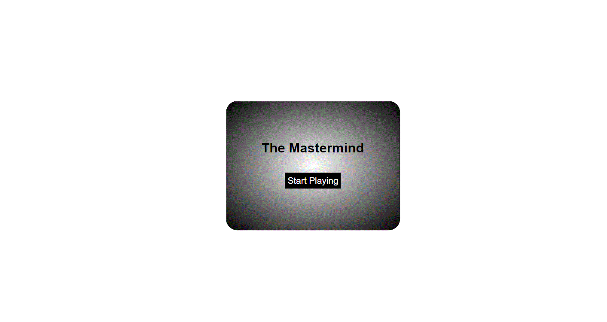
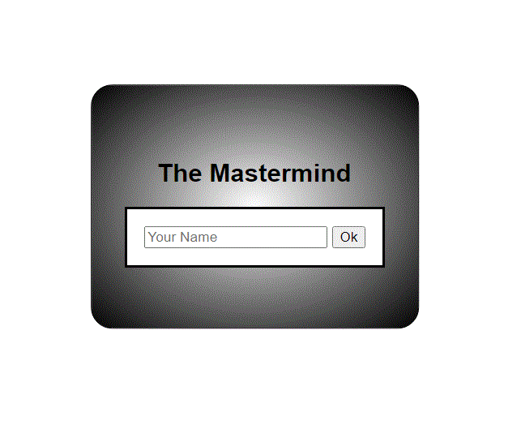
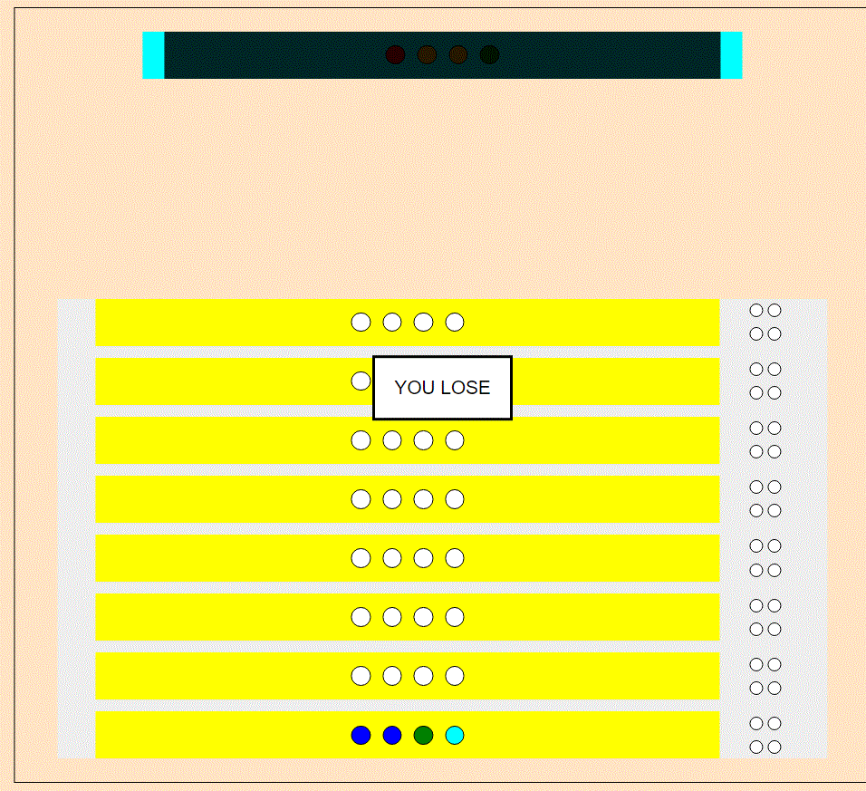
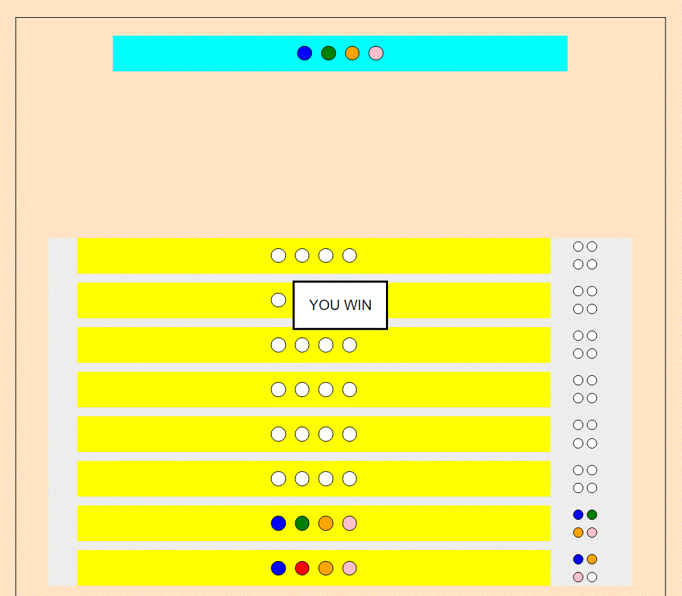
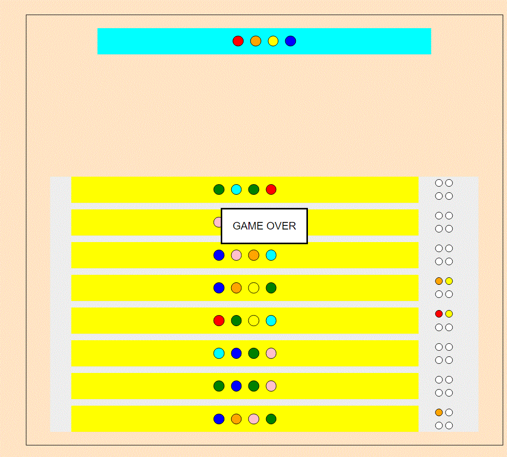

# **The Mastermind Game**

## Description

Mastermind game on [wikipedia](<https://en.wikipedia.org/wiki/Mastermind_(board_game)>).

## Wireframes

[Project WF](https://drive.google.com/file/d/1yfIKqCnkdzodZbOoAWQlaVri5tLzqK2P/view)

#### Sreenshuts

---

### _How to Play_

- Select Start
- Follow the instructions to play against the computer

Online project [link](http://amir-mayyad.surge.sh).

## How Does the javascript Code Work

- The code starts by creating a Mastermind class object in 'gameBoardWithClasses.js'
- This will create a CodeMaker and a CodeBreaker classes.
- The CodeMaker can be used new to generate a new color code, and the secret code is hidden from the players eyes to make start
  guessing the right answer.

## Acknowledgments

- [Payne Fulcher](mailto:pfulcher26@gmail.com)
- [Mastermind Game Explained](https://www.youtube.com/watch?v=Dn0iqlY5tMU&ab_channel=GatherTogetherGames)
